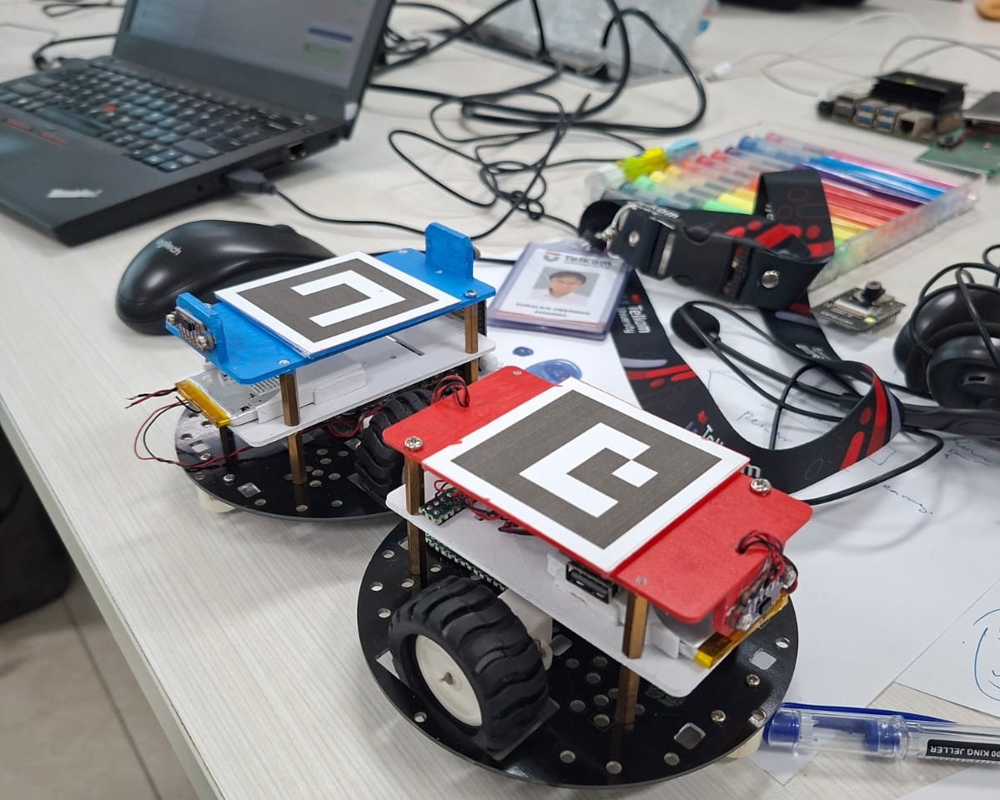

# Swarm / Multi-Robot Hackathon




- [Multi-robot Architecture](architecture.md)
- [Some Result Videos](demo-videos.md)

---
## Topics

- [Robots and Markers](robots.md)
- [Vision Tracker with Single Camera](vision-single-cam.md)
- [Vision Tracker with N cameras](vision-n-cams.md)
- [CameraHub](camerahub.md)
- [ArucoHub](arucohub.md)
	- [ArucoHub Viewer](arucohub-viewer.md)
- [Remote Python GUI](remote-gui.md)
- [Point-to-point Movement](point-to-point.md)
- [Waypoint Path Following with Pure Pursuit](waypoint-pure-pursuit.md)

---
## Our vision backbone
```
~/works/
├── camera_hub/
├── aruco_hub/
│   └── config/
│       ├── aruco_hub.json
│       ├── checkerboard_homography1.json
│       └── checkerboard_homography2.json
├── python/
│   └── camera_hub_client.py
└── tools/
    └── compute_checkerboard_homography.py
```

[__CameraHub and ArucoHub Service Control__](service-control.md)

Currently we use 2 cameras with shared view as tracking system:


_Special note:_
Running from a remote desktop software (such as NoMachine) can cause the DBUS inaccessible.
```bash
echo 'export DBUS_SESSION_BUS_ADDRESS=unix:path=/run/user/$(id -u)/bus' >> ~/.bashrc
source ~/.bashrc
echo $DBUS_SESSION_BUS_ADDRESS

```

---

_Special note:_
Camera paths (`/dev/video0`, `/dev/video2`, `/dev/video4`, `...`) can change after every fresh boot. TODO: use unique device name based on the camera serial number. At the moment, the solution is to switch the used USB ports and restart the CameraHub service.

```
/dev/video0
  serial      : 2549AP84M4V8
  stable path :
  /dev/v4l/by-id/usb-046d_Brio_100_2549AP84M4V8-video-index0

/dev/video2
  serial      : 2543APK5N198
  stable path :
  /dev/v4l/by-id/usb-046d_Brio_100_2543APK5N198-video-index0

/dev/video4
  serial      : 2510APT06F88
  stable path :
  /dev/v4l/by-id/usb-046d_Brio_100_2510APT06F88-video-index0
```

### Two Cameras


### Three Cameras
- USB controller topology is important for using 3 cameras. Jetson has only one USB controller> Raspberry Pi 5 is more suitable for three-camera tracking. However, ArUco detection on three 2K-frames push the Raspberry Pi to its limits.
- Detecting ArUco is an expensive task!

```
2549AP84M4V8 ───── 2543APK5N198
   LEFT               CENTER
                         |
                         |
                         |
                    2510APT06F88
                   PERPENDICULAR
```


---

## Working with our Jetson Orin Nano

- [Jetson Master SD Backup and Image-to-SD Clone Runbook](sd-backup-clone.md)
- [Clone a Master SD Card to an Empty NVMe SSD](sd-to-blank-nvme.md)
