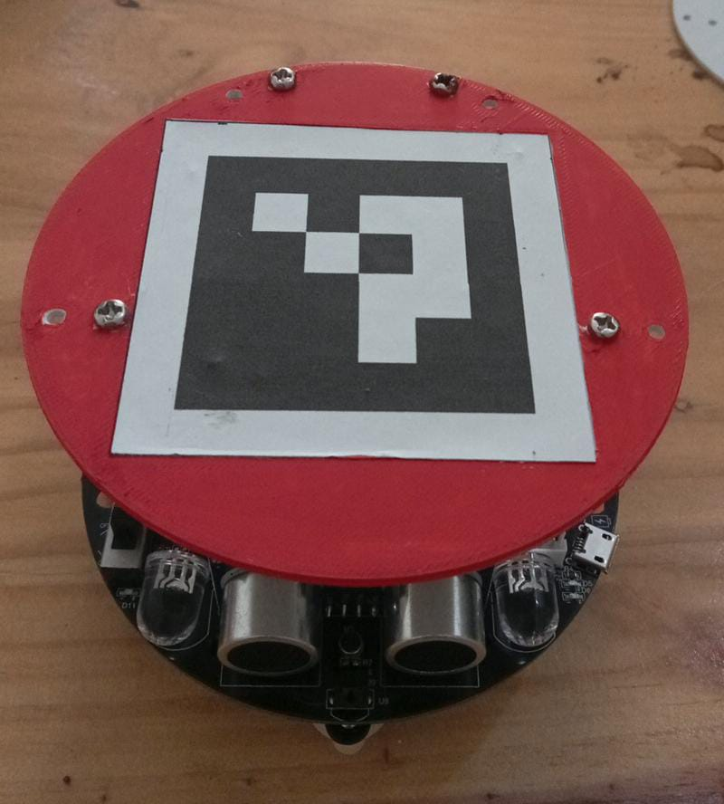
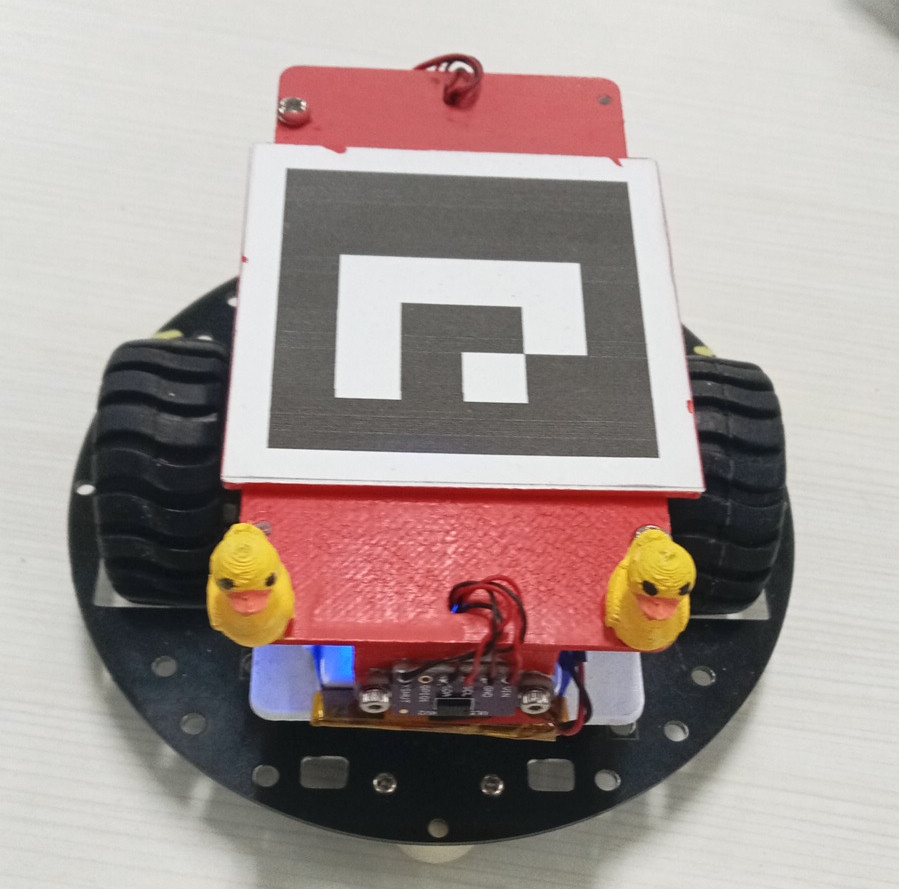
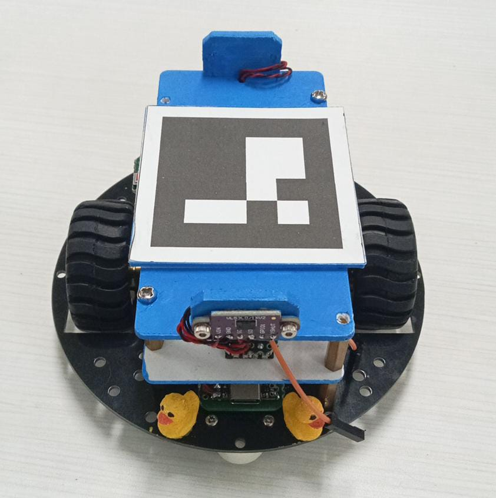
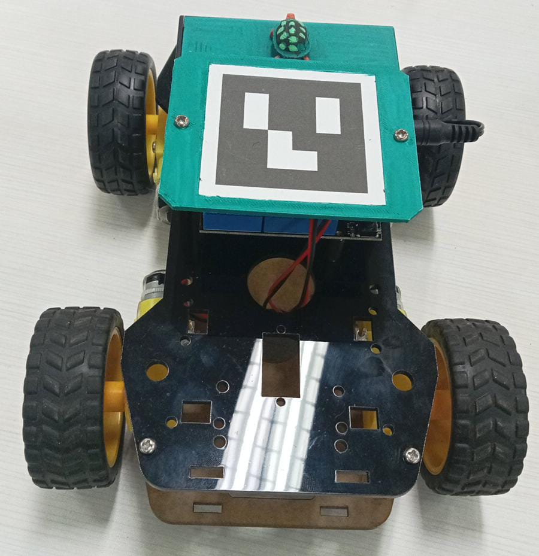
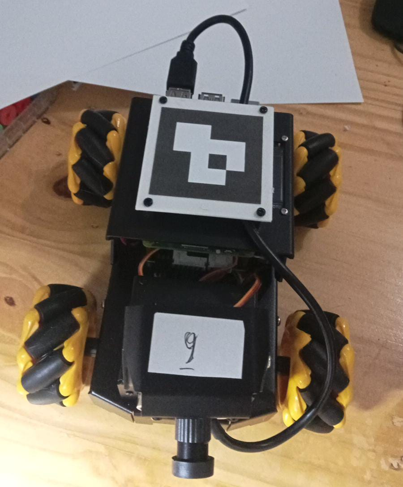

# The Robots
## `Robot 00`
- Yahboom Tiny::bit
- BLE coonnectivity

|  |
| -------------------------------- |

## `Robot 01`
- Costum robot
- ESP32-S3 Super Mini
- WiFi connectivity
- [Setup the robot](schematics.md)

|  |
| --------------------------------- |

## `Robot 02`
- Custom robot
- ESP32-C6 Super Mini
- WiFi connectivity
- [Setup the robot](robots.md)

|  |
| --------------------------------- |

## `Robot 03`
- [ACEBOTT Smart Car Starter Kit](https://acebott.com/docs/qd001-smart-car-starter-kit-for-esp32/)
- WiFi connectivity
- Mechanum wheels are replaced with normal rubber wheels.
- ESP32 Max V1.0 Controller Board 
- ESP32 Car Shield V1.0

|  |
| --------------------------------- |

# `Robot 09`
- [Raspbot V2](https://www.yahboom.net/study/RASPBOT-V2)
- WiFi connectivity
- Raspberry Pi 5
- [Setup the robot](robot09.md)

|  |
| -------------------------------- |

## Placing ArUco markers on the robot
Marker size: $50 \text{mm} \times 50 \text{mm}$
Dictionary: `DICT_4X4_50`
Marker generator: https://chev.me/arucogen/

|  |
| --------------------------------------------------------- |

## The checkerboard
We use ordinary large-size checkerboard for a chess game. The board is stiff (made of wooden material) with green and (perhaps) white colors.

|  |
| --------------------------------------------------------- |

[Purchase link](https://www.tokopedia.com/adityasports/papan-catur-aja-lipat-4-tanpa-bidak-motif-kayu-standar-percasi-board-games-1729444376975543176)